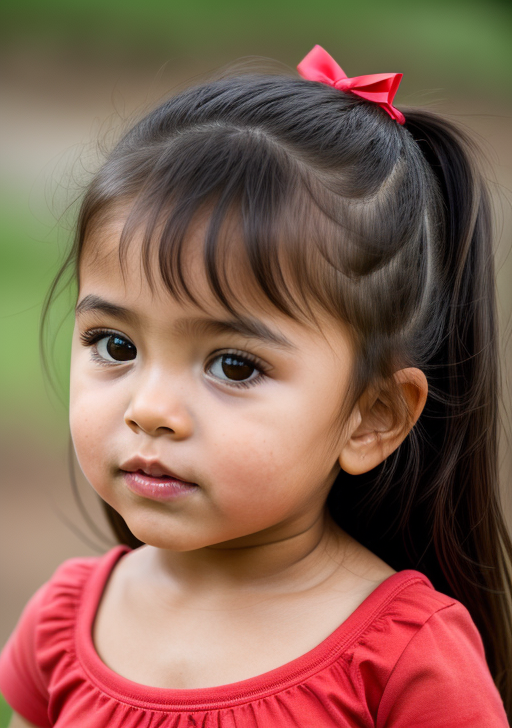

# Baby-pics Cog model

This is an implementation of a custom model [Baby-pics](https://huggingface.co/microsoft/phi-2) as a [Cog](https://github.com/replicate/cog) model. Inspired by [Yifan Goh](https://twitter.com/imgyf) and his webapp OurBabyAI

## Development

Follow the [model pushing guide](https://replicate.com/docs/guides/push-a-model) to push your own model to [Replicate](https://replicate.com).

## Basic Usage

Run a prediction:

    cog predict -i gender="girl" -i image=@mom2.png -i image2=@dad2.png

Output Example:

